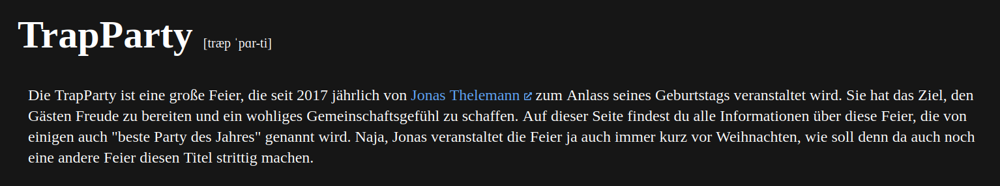

# TrapParty

TrapParty's online version: [trapparty.jonas-thelemann.de](https://trapparty.jonas-thelemann.de/).

## Table of Contents
1. **[Development](#development)**
1. **[Deployment](#deployment)**

## Development
This project builds upon the [Nuxt.js](https://nuxtjs.org/) framework.
Install [Node.js](https://nodejs.org/) and [pnpm](https://pnpm.io/).
Then run `pnpm i` to install the project's dependencies.
After that, use `pnpm dev` for development or `pnpm build` to generate the [static page](https://nuxtjs.org/blog/going-full-static).

Alternatively, build the provided [Dockerfile](https://www.docker.com/) using `docker build -t dargmuesli/trapparty .` and run the resulting image using `docker run dargmuesli/trapparty`.

## Deployment
This project is deployed within the [jonas-thelemann_stack](https://github.com/dargmuesli/jonas-thelemann_stack/) in accordance to the [DargStack template](https://github.com/dargmuesli/dargstack_template/) to make deployment a breeze.
